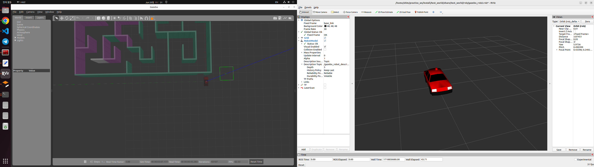
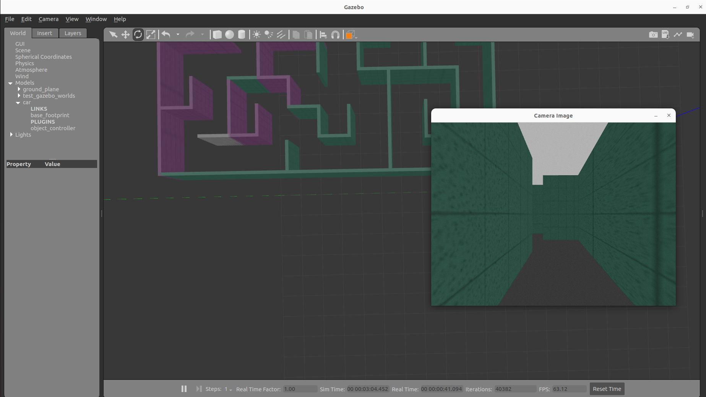
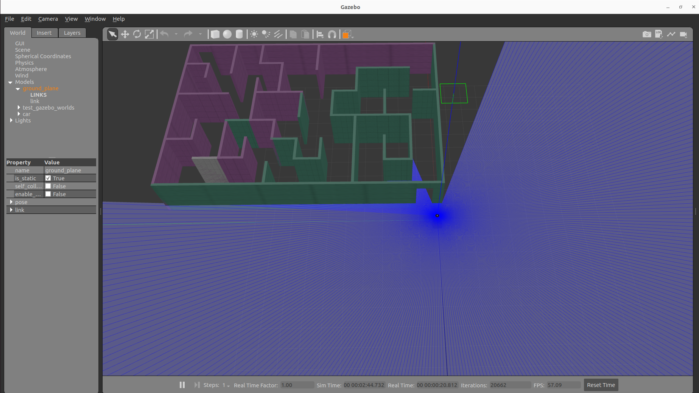

# Rviz_Gazebo
#### 현 문서는 Rviz2, Gazebo 사용법 연습을 위한 문서입니다.


# environment (세팅 환경)


해당 프로그램은 우분투 22.04 jammy 환경에서 빌드되었으며 ROS2 humble 버전을 사용합니다.

# Installation
```bash
mkdir -p ~/ros2_ws/src
cd ~/ros2_ws/src

git clone https://github.com/dkzpdhtm12/rviz_gazebo_test.git

sudo apt update

rosdep update
rosdep install -i --from-path rviz_gazebo --rosdistro humble -y

cd ~/ros2_ws
colcon build -- symlink-install

source ~/ros2_ws/install/local_setup.bash
```
---
- 주의

  월활한 종속성 설치가 안될 경우 하단을 참고하세요.
```bash
rosdep install -i --from-path Ros2_Practice --rosdistro humble -y

# ex)
sudo apt update && sudo apt upgrade
sudo apt install ros-humble-(Name of dependency to install) -y
```

# Step (단계)

#### 현재 단계에서는 Rviz2와 Gazebo 다양한 환경 세팅을 시도해 본 내용을 다룹니다.

### How to run (실행 방법)
---
```bash
ros2 launch rviz_gazebo car_gazebo.launch.py
```

### Launch Image


## Camera

__카메라 플러그인을 활용하여 모델에 카메라 링크를 설정하는 단계입니다.__


```bash
ros2 launch test_world car_camera_gazebo.launch.py
```

### Launch Image


You can print the image as shown above.

### 수정사항 발생...
- 카메라 모델의 TF 생성 방향을 잘못 설정하여 방향이 보는 방향과 다릅니다.
  
## Lidar

__라이다 플러그인을 활용하여 모델에 라이다 링크를 설정하는 단계입니다.__

- 라이다 센서의 플러그인의 자세한 내용은 하단 링크를 참조하시길 바랍니다.
  #### [Gazebo plugin](https://classic.gazebosim.org/tutorials?tut=ros_gzplugins#Laser)

```bash
ros2 launch test_world car_lidar_gazebo.launch.py
```
### Launch Image


## 공통사항
__Gazebo 시뮬레이터 내에서 모델을 움직이고 싶다면 하단 내용을 참고하시길 바랍니다.__

- 기본적으로 모델은 /cmd_vel 토픽으로 움직일 수 있습니다.
```bash
sudo apt update

sudo apt install ros-humble-teleop-twist-keyboard -y

ros2 run teleop_twist_keyboard teleop_twist_keyboard
```
이제 키보드 조작으로 모델을 움직여 볼 수 있습니다.